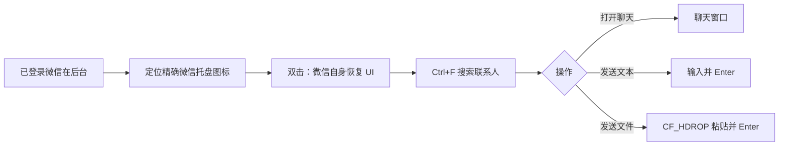

<div align="center">

# WeChatAuto

**面向 Windows 微信桌面端的可靠自动化工具**

通过真实托盘唤起已登录客户端，再完成联系人搜索、文本发送与文件发送。

[](#环境要求)
[](#安装)
[](LICENSE)
[](https://github.com/strong68/WeChatAuto)

</div>

> [!WARNING]
> 请仅对你有权操作的账号、联系人和文件使用本项目。发送文本或文件会产生真实的外部副作用；执行前请确认收件人、消息和文件路径。

## ✨ 为什么是 WeChatAuto？

微信 4.x 是多进程 Qt 桌面程序。直接强制显示隐藏窗口，可能只得到一个白色外壳；重新启动客户端，又可能打开另一个实例。

WeChatAuto 复现了已验证的人工操作路径：**定位任务栏通知区域的精确“微信”图标并双击**，让微信自己恢复渲染和登录状态。之后再利用微信原生 `Ctrl+F` 搜索入口完成自动化。

| 能力 | 说明 |
| --- | --- |
| 🟢 恢复客户端 | 通过系统托盘唤起已登录微信，不启动 `Weixin.exe` |
| 🔎 打开聊天 | 搜索联系人并打开首个匹配会话 |
| 💬 发送文本 | 输入并发送一条纯文本消息 |
| 📎 发送文件 | 使用 Windows `CF_HDROP` 文件剪贴板粘贴并发送本地文件 |
| 🧩 可持续维护 | `src/` 包布局、分层模块、单元测试、Ruff 检查和打包配置 |

## 🧭 工作方式



## 环境要求

- Windows 10 或 Windows 11
- 已登录、正在运行的微信 Windows 客户端
- Python 3.10+
- 当前实现依赖中文系统托盘控件名“微信”；其他语言环境可在 `src/wechat_auto/constants.py` 调整 `WECHAT_TRAY_NAME`

## 安装

### 使用 Conda（推荐）

```powershell
conda create -n WeChatAuto python=3.11 -y
conda activate WeChatAuto
git clone https://github.com/strong68/WeChatAuto.git
cd WeChatAuto
python -m pip install -e ".[dev]"
```

### 仅运行

```powershell
python -m pip install .
```

## 快速开始

先在 Windows 上登录微信并保持其运行。以下每条命令都不会创建新微信实例。

### 1. 唤起已登录微信

```powershell
python main.py
```

### 2. 搜索并打开聊天

```powershell
python main.py 好友备注名
```

### 3. 发送文本

```powershell
python main.py 好友备注名 --send "你好，这是一条测试消息"
```

### 4. 发送文件

```powershell
python main.py 好友备注名 --file "D:\path\to\report.pdf"
```

安装后，也可以使用命令行入口：

```powershell
wechat-auto 好友备注名 --send "你好"
```

> [!TIP]
> 尽量使用唯一的好友备注名。若搜索结果存在同名联系人，微信会打开首个结果。

## 命令参考

```text
python main.py [好友备注名] [--send "文本"] [--file "文件路径"] [--verbose]
```

| 参数 | 作用 |
| --- | --- |
| `friend` | 可选。要搜索的好友备注或名称 |
| `--send MESSAGE` | 打开聊天后发送文本；不能与 `--file` 同时使用 |
| `--file PATH` | 打开聊天后发送一个已存在的本地文件；不能与 `--send` 同时使用 |
| `--verbose` | 输出更多诊断日志，便于排查托盘或窗口问题 |

## 项目结构

```text
WeChatAuto/
├── src/wechat_auto/
│   ├── cli.py          # 命令行参数与错误处理
│   ├── client.py       # 高层工作流：打开、搜索、发送
│   ├── tray.py         # 任务栏通知区域 UI Automation
│   ├── clipboard.py    # 64 位安全的 CF_HDROP 文件剪贴板
│   ├── constants.py    # 客户端与系统 UI 标识
│   └── exceptions.py   # 领域异常
├── tests/              # 无微信副作用的单元测试
├── docs/architecture.md
├── pyproject.toml      # 依赖、打包、Ruff、Pytest 配置
└── main.py             # 向后兼容入口
```

完整设计和新增功能的调试原则请看 [架构文档](docs/architecture.md)。

## 开发与质量检查

```powershell
python -m pytest
python -m ruff check .
```

新增桌面自动化功能时，请遵循这一原则：**先采集后台基线 → 手动完成一次目标操作 → 比较前后状态 → 自动化应用自身的真实触发路径**。不要仅凭窗口标题或句柄调用 `ShowWindow`。

## 路线图

- [x] 通过托盘恢复已登录微信
- [x] 联系人搜索与聊天打开
- [x] 文本与单文件发送
- [ ] 搜索结果的联系人身份确认，降低同名误发风险
- [ ] 多文件发送与发送前预览
- [ ] 可配置的语言、托盘名称和等待时间
- [ ] 操作审计日志与 dry-run 模式
- [ ] 集成测试与发布自动化

欢迎通过 [Issues](https://github.com/strong68/WeChatAuto/issues) 提出功能建议和兼容性反馈。

## 贡献

1. Fork 本仓库并创建功能分支。
2. 保持模块边界清晰，为非 UI 逻辑补充单元测试。
3. 运行 `python -m pytest` 与 `python -m ruff check .`。
4. 提交 Pull Request，并说明验证环境中的微信和 Windows 版本。

## License

本项目采用 [MIT License](LICENSE)。
